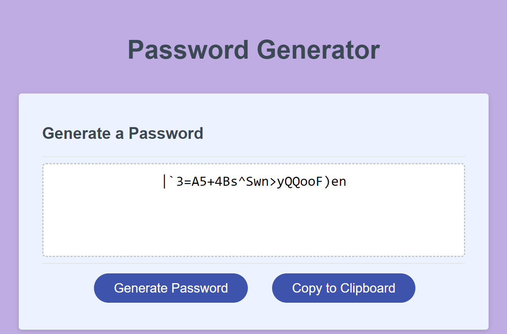

# gabriel-password-gen
Bootcamp Module 3 - Password Generator Challenge

## Description

The purpose of this web application is to genearte a complex password between 8 and 128 characters, including at least one type of character from the following: special characters, numbers, lowercase letters, and uppercase letters.  The user is prompted to choose which criteria they want to include, and once the password is generated and visible on the screen they can also copy the password to the clipboard by clicking the "copy to clipboard" button.

## Usage

Application link:  https://gmgabrie.github.io/gabriel-password-gen/

A user can click the 'generate password' button.  First they will be prompted to choose how many characters between 8 and 128.  If less than 8 or more than 128, a prompt will display notifying the user of the proper requirements. If blank, a prompt will indicate that the entry cannot be blank.  Next, prompts for the types of characters to include will display.  These include special characters, numbers, lower and upper case letters.  The user will need to choose at least one type of character, otherwise a prompt will be displayed telling them this and then the character selection prompts will start over.  Once the password is generated, it will display in the text area.  From there, the user can click the "copy to clipboard" button to copy the displayed password to the clipboard.

## Credits

I utilized several external sources to help with development of this application.  These include:
- prior coding bootcamp lessons
- codepen.io
- W3 Schools
- MDN Web Docs

## Features

- custom color scheme
- input validation for password length and types of characters.
- copy to clipboard button.
- event listener functions for generate password and copy to clipboard buttons.
